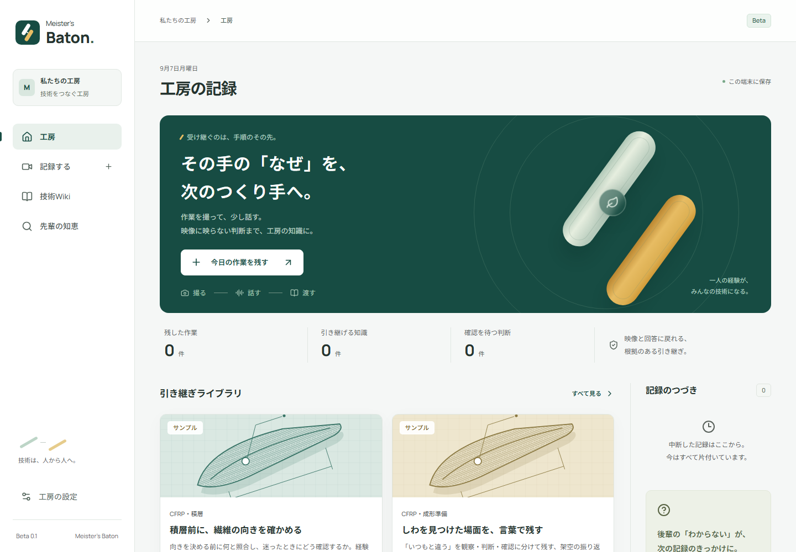

# Meister's Baton

**先輩の判断を、次の作り手が必要な瞬間へ。**

作業映像だけでは分からない「なぜ、そう判断したのか」を質問で引き出し、回答原文と映像に戻れる技術Wikiへ育てるアプリです。鳥人間・ロボコンなど、短い周期で担い手が入れ替わるものづくりチームから使うことを想定しています。

`0.1.0-beta.1` / 日本語UI / React・TypeScript・Vite / Capacitor iOS・Android / Supabase Auth・Postgres・Storage

**公開版:** [https://meisters-baton.vercel.app/](https://meisters-baton.vercel.app/)



2026年9月6–7日に開発した事前ベータです。[開発祭への開示](docs/pre-event-disclosure.md)と当日の変更履歴を分けて扱います。

## 今できること

- 動画の取り込み・対応端末での撮影、作業メモ、途中からの再開。
- 映像の場面を指定した聞き取りと、回答原文を根拠にするWiki下書き。
- 設定済みAPIによる画像解析、質問生成、技術ページの整理、根拠付き回答。
- 主張ごとの確認、公開、改訂履歴、出典映像・回答の参照、検索と未記録質問。
- 端末内保存、JSONの書き出し・追加読み込み、Markdownの書き出し。
- Discord一次資料から作った根拠付きWiki下書きの取り込み、ページツリー表示、原文リンクと添付情報の確認。
- アカウント、チーム招待、動画を含む手動共有、更新競合の検出、退会。
- iOS・Androidのプロジェクト、権限・アイコン・配布前点検、CIのビルド経路。

ネイティブアプリの実機検証、署名済み配布物、運用API、実際のAIモデルでの検証は、ソースと設定を用意したこととは別です。現段階をストア申請可能とは扱っていません。[残る配布条件](docs/release-checklist.md)に、実装済みの基盤と未完了の作業を記録しています。

Androidの試用版APKとiOSシミュレーター用ビルドを、[成功したビルドの成果物](https://github.com/kob952/Meisters-Baton/actions/runs/34080700413)から取得できます（保持期限2026-09-21）。iPhone配布用IPA・ストア署名・実機試験はまだ含みません。

## 公開版を使う

[Meister's Batonを開く](https://meisters-baton.vercel.app/)。インストールやローカルサーバーの起動は不要です。現在の利用・案内はこの公開URLを正本とし、localhostでの運用は行いません。

最初は架空のサンプルが表示されます。「新しい記録」で動画またはメモを保存し、手動の聞き取りからWikiまで進めます。アカウントやAPIキーなしでも、端末内に保存する基本機能を試せます。

## ローカルで開発する

Node.js **22.13以上**を使います。CIとコンテナの設定は22.23.2に揃えています。

```sh
npm ci
npm run dev
```

[http://127.0.0.1:5173](http://127.0.0.1:5173)は開発プレビュー専用です。利用者へ案内するURLには使いません。

チーム共有の開発では `.env.example` を `.env.local` としてコピーし、SupabaseのURLとpublishable keyを設定します。AIも使う場合のみ、別のターミナルでローカルAPIを起動します。

```sh
npm run dev:api
```

開発用AI APIは `127.0.0.1:8787`、画面側の `/api` はそこへ転送されます。共有はAI APIと独立してSupabaseへ接続し、ログインは安全なブラウザー保存領域で維持されます。

## 3つの処理を区別する

| 表示           | 入力と処理                                                                   |
| -------------- | ---------------------------------------------------------------------------- |
| 手動ヒアリング | 自分で選んだ場面と質問に答え、原文から下書きを作る。AIの映像解析ではない。   |
| AIからの質問   | 抽出画像とメモを、認証付きAPI経由でOpenAIへ送る。設定と送信への同意が必要。  |
| サンプル       | 架空の教材と用意した質問で操作する。実映像や実在する人の確認の証拠ではない。 |

AIが読むのは動画から抜き出した最大12枚の画像です。動画全体の連続した動作や音声は解析しません。生成物は下書きで、人が根拠と内容を確認してから公開します。材料・温度・配合など、元記録にない製造条件を正解として補うためのアプリではありません。

## AIと共有の設定

`.env.local`（画面）と `.env`（任意のAI API）の主な設定:

| 変数                                | 用途                                                              |
| ----------------------------------- | ----------------------------------------------------------------- |
| `VITE_SUPABASE_URL`                 | チーム共有用SupabaseプロジェクトURL。                             |
| `VITE_SUPABASE_PUBLISHABLE_KEY`     | ブラウザー用publishable key。RLSと組み合わせて使う公開可能な値。  |
| `OPENAI_API_KEY`                    | 任意のAIサーバーだけに置く秘密キー。`VITE_`は付けない。           |
| `OPENAI_MODEL`                      | 既定は `gpt-6-astra`。実際に使えるかはAPIアカウントの権限による。 |
| `ALLOWED_ORIGINS` / `HOST` / `PORT` | 任意のAI APIの許可originと待受設定。                              |

秘密のservice-role keyやOpenAI APIキーを `VITE_` 環境変数やモバイルアプリへ含めないでください。Supabaseのpublishable keyはブラウザー利用を前提とし、データの制限はRLSで強制します。

共有の前にチーム名と送信内容を確認します。下書き・回答・動画も共有対象です。サンプルは除外します。同期の取得は端末データを残し、変更が衝突した場合は停止します。動画の共有は1件50MBまでです。JSONバックアップには動画本体・フレーム画像が含まれないため、元動画を別に保管してください。

共有基盤の詳細は [docs/supabase.md](docs/supabase.md)、任意のAI APIは [server/README.md](server/README.md)、データの取扱いは [docs/privacy.md](docs/privacy.md) を参照してください。

## 本番ビルドを検証する

```sh
npm ci
npm run build
```

サーバー環境または `.env` で `NODE_ENV=production` を設定してから起動します。

```sh
npm start
```

APIと `dist/` の画面を同じサービスで配信します。ローカル検証時の既定の待受は [http://127.0.0.1:8787](http://127.0.0.1:8787) です。このURLは運用先ではありません。公開版は [https://meisters-baton.vercel.app/](https://meisters-baton.vercel.app/) を使い、別環境へ配備する場合はHTTPSの運用先と正確な許可originを用意します。

`npm start` は `tsx` を使用します。現構成では開発依存も実行時に必要なため、`npm ci --omit=dev` は使いません。

### Docker

Docker Engine / Docker Desktop とComposeを用意します。`.env` を使う場合は、Dockerで開くoriginを `ALLOWED_ORIGINS` に設定してください。開発用 `.env.example` をそのままコピーした場合も、この項目を確認します。

```sh
docker compose build
docker compose up -d
docker compose ps
```

既定ではローカル検証用の [http://127.0.0.1:8787](http://127.0.0.1:8787) だけに公開します。画面とAPIは同じコンテナで動き、SQLiteと動画は `baton-data` ボリュームへ保存します。コンテナは非rootで起動し、書き込み先はデータ領域と一時領域に限定します。APIキーは実行時の環境から渡し、イメージに埋め込みません。

停止は `docker compose down`。**`down --volumes` は共有記録のボリュームも削除するため、通常の停止には使いません。** 外部公開にはHTTPSを終端するリバースプロキシ、アクセス制限、バックアップ・復元の運用が必要です。SQLite版は単一インスタンスで運用します。

GitHub CIでDockerイメージのビルド・非root起動・コンテナ再作成後のアカウント、記録、メディアの保持を確認済みです。[検証結果](docs/verification.md)を参照してください。Composeによる運用先への配備と実運用バックアップの復旧は別途確認します。

## 検証する

```sh
npm run typecheck
npm test
npm run build
npx playwright install chromium
npm run test:e2e
node scripts/mobile-preflight.mjs
```

実行した結果と試験範囲は [検証記録](docs/verification.md) にまとめています。ドメイン/APIのテストは固定のプロバイダーを使い、実際のOpenAI API課金は発生させません。ブラウザー試験と設定点検は、iPhone・Android実機や実動画の専門家評価の代わりにはなりません。結果は実行したコミットのログと対応付けてください。

モバイルの生成物・SDK・署名・GitHub Actionsは [モバイル配布手順](docs/mobile-release.md) にまとめています。

## リポジトリの案内

Meisterサーバーの「プロペラ」カテゴリを、常設Botなしで原文・画像・動画ごと保全して開発チームへ移す場合は、[低侵襲Discord移植手順](docs/discord-migration.md)を参照してください。取得は管理者PC上の一時的な読み取り専用Bot、移植は別の開発チーム用Botに分離しています。取得後は、検索できるローカル閲覧版と、原文を根拠として保持するWiki下書きを生成できます。

```text
src/             画面とアプリ状態
src/domain/      記録・根拠・承認の型と規則
src/lib/         端末保存、動画処理、API接続
server/          任意のOpenAI API中継と従来のローカル共有実装
supabase/        チーム認証・共有データ・非公開動画のマイグレーション
tests/           ドメインとAPIの検証
android/ ios/    モバイルアプリ用プロジェクト
scripts/         アイコンと配布前点検
docs/            製品、設計、デモ、配布、来歴
```

[製品の完成条件](docs/product.md) / [アーキテクチャ](docs/architecture.md) / [デザイン](docs/design.md) / [3分デモ](docs/demo.md) / [参照したスキル](docs/skill-usage.md) / [第三者ソフトウェア・フォントの帰属](docs/third-party.md)
